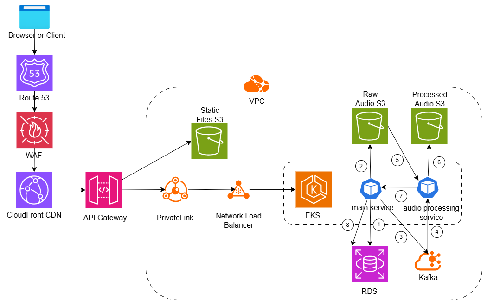

# Audio Hosting App :musical_note:

## Introduction

This web application is an audio hosting application with the frontend developed using React.js, the backend developed with NodeJS, and using a Postgres database.

I endeavour to make more improvements to this application (including the below architecture diagram) before the 18th June 2025, including but not limited to the following:

1. Analyse and implement the handling of various file formats (e.g. mp4/avi). Application currently only tested for mp3 format. Update 17/6: Tested for mp3,ogg,wav,flac,aac. (Done)
2. Analyse and implement a more scalable file storage solution, as local storage will certainly not scale. (Not required)
3. Suggest production-ready architecture. (Done)
4. Clean up as there is dead code. (Done)

Any suggestions or feedback are welcomed :smile:

**<u>PLEASE NOTE THERE ARE AUDIO FILES IN THE `audio` FOLDER FOR TESTING PURPOSES</u>**

## Deliverables

### 1. Documentation showing the system architecture & API definition

**<u>System architecture diagram for this repo</u>**

The below is a simple high-level architecture diagram of the application when starting the production build per section 4.

**<u>System architecture diagram for product-ready system</u>**

The below is a production-ready architecture diagram, with the assumption that audio files need to go through some form of processing before the final storage. As cloud services can enable the system to scale both in terms of storage and compute, I will reference AWS technologies below.

* DNS system (Route 53): for DNS Management
* Web Application Firewall (WAF): for web security (i.e. DDoS, SQL injection, Rate Limiting, etc.)
* CDN (CloudFront CDN): for edge location delivery, static asset caching
* API Gateway: direct traffic to get either static files or dynamic data from services
* Static File storage for React SPA and other static assets (S3)
* Static File storage for raw and processed audio files (S3)
* Kubernetes cluster (EKS): managed k8s cluster to deploy microservices. With regards to the k8s cluster, the below is how the deployments within it can orchestrate the processing of large files in large quanitites in a asynchronous fashion:
  1. When a request comes into the main service, write audio file metadata to RDS DB.
  2. Then write the audio file to an S3 bucket to store it in its raw form
  3. Push a message to a message queue (i.e. kafka) containing metadata of the raw audio file
  4. Audio processing service would consume the message from step 3 when it has free server resources
  5. Audio processing service would pull the audio file from the raw audio bucket based on the metadata in the received message, and process it (i.e. compression)
  6. The processed audio file would be written to a processed audio file bucket
  7. The audio processing service can inform the main service that processing on the file is done through API call or a message
  8. The main service would update RDS DB that processing has been done.

If the system has any performance bottle neck when sending large audio file from clients (i.e. browsers) to the backend, we can consider chunking or using presigned URLs to write the files directly to file storage (S3).

**API definition**: Please copy `swagger.yml` and enter the contents into `http://editor.swagger.io/` to view the swagger API documentation

### 2. Source Code

In this repository

### 3. Docker file

Please refer to the `docker` folder in this repository for the docker files.

### 4. Scripts to build the Docker file

Please use `git bash` or any bash CLI.

**To start dev build**: 

1. From the root of this folder, execute `chmod +x ./scripts/dev-start.sh`
2. From the root of this folder, execute `./scripts/dev-start.sh`
3. Go to `http://localhost:3000` to access the app.  The default username is `admin`, and the default password is `admin123`
4. After using the app, execute `./scripts/dev-teardown.sh` to clean up

**To start production build**: 

1. From the root of this folder, execute `chmod +x ./scripts/prod-deploy.sh`
2. From the root of this folder, execute `./scripts/prod-deploy.sh`
3. Go to `http://localhost:3000` to access the app.  The default username is `admin`, and the default password is `admin123`
4. After using the app, execute `./scripts/prod-teardown.sh` to clean up

### 5. Any other run time instruction (e.g., 8080 to host app, 7000 database, OS type)

To inspect components of the application (i.e. API or database), please start the development build.

1. UI: `http://localhost:3000`
2. API: `http://localhost:5000`
3. Swagger: `http://localhost:5000/api/docs/`
4. database: `http://localhost:5432`, kindly refer to the respective docker file to check the database details and credentials

## Personal reference

1. `docker stop $(docker ps -a -q)`
2. `docker rm $(docker ps -a -q)`
3. `docker system prune -a -f`
4. `docker volume prune -a -f`