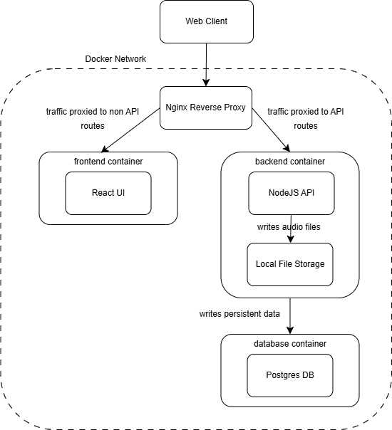

# Audio Hosting App :musical_note:

## Introduction

This web application is an audio hosting application with the frontend developed using React.js, the backend developed with NodeJS, and using a Postgres database.

I endeavour to make more improvements to this application (including the below architecture diagram) before the 18th June 2025, including but not limited to the following:

1. Analyse and implement the handling of various file formats (e.g. mp4/avi). Application currently only tested for mp3 format.
2. Analyse and implement a more scalable file storage solution, as local storage will certainly not scale.
3. Improve architecture diagram, and suggest a truly production-ready architecture.
4. Clean up as there is dead code

Any suggestions or feedback are welcomed :smile:

**<u>PLEASE NOTE THERE ARE AUDIO FILES IN THE `audio` FOLDER FOR TESTING PURPOSES</u>**

## Deliverables

### 1. Documentation showing the system architecture & API definition

**System architecture**

The below is a simple high-level architecture diagram of the application when starting the production build per section 4.

**API definition**: Please copy `swagger.yml` and enter the contents into `http://editor.swagger.io/` to view the swagger API documentation

### 2. Source Code

In this repository

### 3. Docker file

Please refer to the `docker` folder in this repository for the docker files.

### 4. Scripts to build the Docker file

Please use `git bash` or any bash CLI.

**To start dev build**: 

1. From the root of this folder, execute `chmod +x ./scripts/dev-start.sh`
2. From the root of this folder, execute `./scripts/dev-start.sh`
3. Go to `http://localhost:3000` to access the app.  The default username is `admin`, and the default password is `admin123`
4. After using the app, execute `./scripts/dev-teardown.sh` to clean up

**To start production build**: 

1. From the root of this folder, execute `chmod +x ./scripts/prod-deploy.sh`
2. From the root of this folder, execute `./scripts/prod-deploy.sh`
3. Go to `http://localhost:3000` to access the app.  The default username is `admin`, and the default password is `admin123`
4. After using the app, execute `./scripts/prod-teardown.sh` to clean up

### 5. Any other run time instruction (e.g., 8080 to host app, 7000 database, OS type)

To inspect components of the application (i.e. API or database), please start the development build.

1. UI: `http://localhost:3000`
2. API: `http://localhost:5000`
3. Swagger: `http://localhost:5000/api/docs/`
4. database: `http://localhost:5432`, kindly refer to the respective docker file to check the database details and credentials

## Personal reference

1. `docker stop $(docker ps -a -q)`
2. `docker rm $(docker ps -a -q)`
3. `docker system prune -a -f`
4. `docker volume prune -a -f`